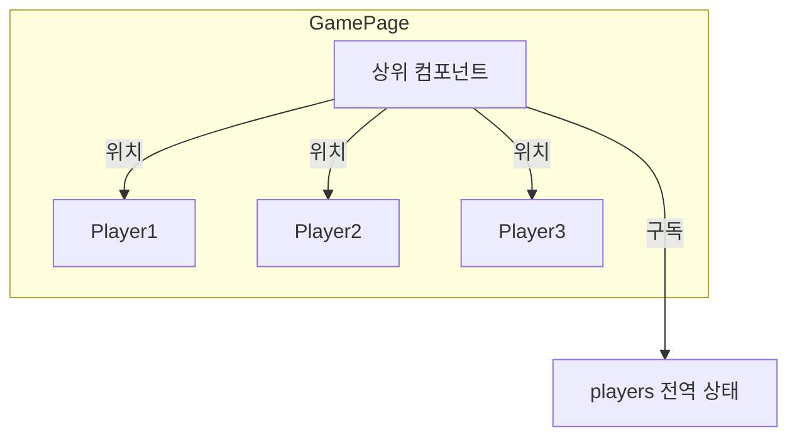
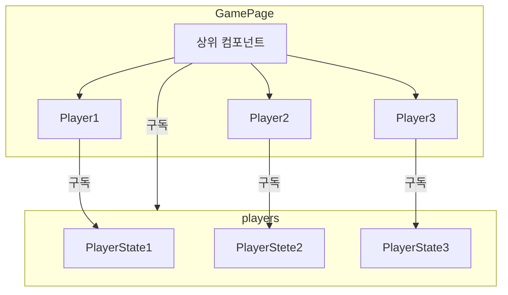

퀴즈 그라운드는 플레이어가 이동하여 답을 선택할 수 있습니다.

이 글에서는 200명의 플레이어가 **1초에 1번 씩** 움직인다는 가정 하에서 최적화를 다룹니다.


# 성능 측정 방법

먼저 200명이 동시에 플레이를 하였을 때 제대로 성능이 나오는지 측정해보겠습니다.

- 매 시도마다 동일한 환경을 만들기 위해 웹소켓을 모킹하여 시뮬레이션 합니다.
- 플레이어는 200명이 있으며, 1인당 1초에 1번 움직임을 만들며 이를 5초 동안 진행합니다. (여기서 setTimeout을 사용하므로 성능에 따라 5초보다 더 지연될 수도 있습니다.)
- 시뮬레이션의 시작과 끝을 Performance API를 사용해 측정합니다.

최적화 전 측정 결과는 **16.71초**입니다.

# 움직이는 플레이어만 리렌더링

리액트 개발자 도구를 통해 한 명의 플레이어만 움직여도 전체 플레이어가 리렌더링 됨을 알 수 있었습니다. 이 이유는 다음과 같습니다.


현재 **zustand**를 통해 플레이어들의 상태를 전역을 관리하고 있습니다. 그리고 플레이어의 상위 컴포넌트가 players 전역 상태를 구독하여 각 플레이어 컴포넌트들에게 **props**로 위치를 넘겨주고 있습니다.



따라서 하나의 플레이어가 움직여도 위해선 전체 플레이어가 리렌더링된 것입니다.

이를 어떻게 해결할 수 있을까요? 아래의 두가지의 해결 방법이 있습니다.

- `React.memo`: 리렌더링 시 이전 prop을 비교하여 변경된 플레이어만 리렌더링
- `Zustand Selector`: 플레이어가 직접 자신의 상태를 구독

결과적으로는 **Zustand selector**를 선택하여 최적화를 했습니다. 자세한 이유는 아래에 있습니다.

## React.memo

`React.memo`는 리렌더링 시 이전 props를 비교해 변경된 컴포넌트만 리렌더링해주는 함수입니다.

React.memo의 매개변수로 플레이어 컴포넌트 함수를 전달하면 memo가 적용된 함수를 반환합니다.

```js
const Player = React.memo(() => {
  // 플레이어 컴포넌트
});
```

## Zustand Selector

**zustand**는 `selector` 함수를 통해 원하는 상태를 쉽게 구독할 수 있습니다.

```js
const players = usePlayerStore((state) => state.players);
```

유용한 점은 복잡한 셀렉터 함수도 가능하다는 것입니다.

아래 처럼 players가 배열이라면 인덱스로 본인의 상태를 직접 구독할 수 있습니다.

```js
// 플레이어 컴포넌트에서 인덱스로 구독
const player = usePlayerStore((state) => state.players[index]);
```

## 최종 결정

결과적으로 Zustand의 Selector를 이용해 플레이어가 **직접 자신의 상태를 구독하게** 하였습니다. 이렇게 결정한 이유는 아래와 같습니다.

- Player 컴포넌트에 React.memo를 해도 매 움직임마다 상위 컴포넌트도 같이 리렌더링됩니다.
- props로 값을 전달하는 것보다 유지보수하기 편할 것이라 판단하였습니다.



# 움직임 배치 처리

여기서 조금 더 최적화를 할 수 있을까요?

현재는 1초에 200번의 플레이어의 위치 상태가 빈번히 변하고
