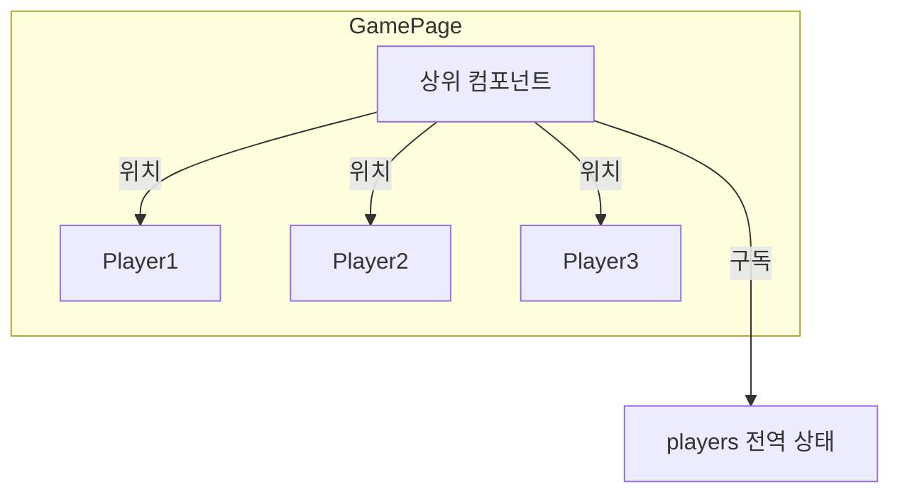
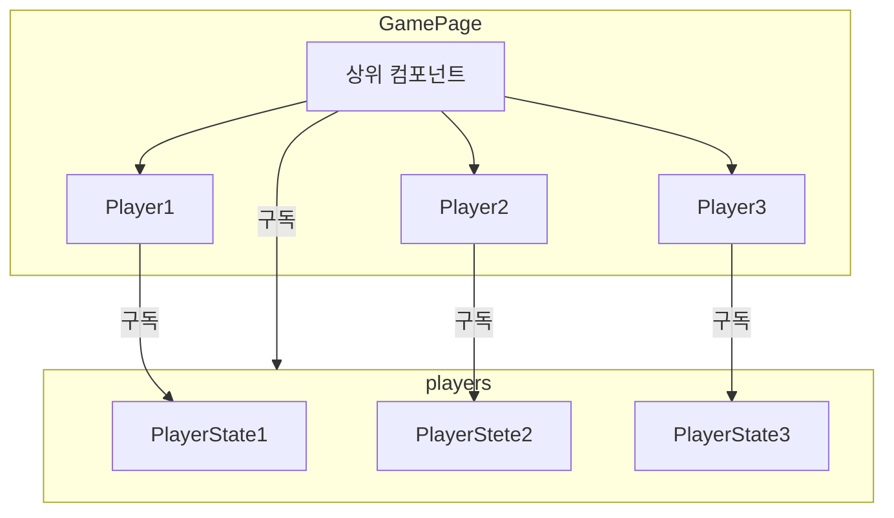

퀴즈 그라운드는 실시간 퀴즈 서비스이며, 플레이어가 **이동하여 답을 선택**할 수 있습니다. **문제는** 200명의 사용자가 동시에 플레이할 수 있으며, 클릭이나 터치로 손쉽게 이동할 수 있기에 **수많은 이동**이 생긴다는 것입니다.

이 글에서는 200명의 플레이어가 **1초에 1번 씩** 움직인다는 가정 하에서 최적화를 다룹니다.


# 성능 측정 방법

먼저 200명이 동시에 플레이를 하였을 때 제대로 성능이 나오는지 측정해보겠습니다.

- 매 시도마다 (거의) 동일한 테스트 환경을 만들기 위해 **웹소켓을 모킹**하여 시뮬레이션 합니다.
- 플레이어는 **200명이 있으며, 1인당 1초에 1번** 움직임을 만들며 이를 **5초 동안** 진행합니다. (setTimeout을 사용하므로 메인 스레드 작업량에 따라 5초보다 더 지연될 수도 있습니다.)
- 시뮬레이션의 **시작 시간**과 **종료 시간**을 [Performance API](https://developer.mozilla.org/en-US/docs/Web/API/Performance)를 사용해 측정합니다.

> 최적화 전 측정 결과는 **16.21초**입니다.

# players를 Array에서 Map으로

**players**는 zustand로 선언된 플레이어들의 위치를 포함한 전역 상태입니다. 기존에는 `Array`로 되어있었습니다. 그렇다면 문제는 무엇일까요?

```js
type Player = {
  playerId: string,
  playerName: string,
  playerPosition: [number, number], // [x, y] 좌표
  playerScore: number,
  isAnswer: boolean,
  isAlive: boolean,
  emoji: string,
  isHost: boolean,
};

// players 전역 상태의 타입
type PlayerStore = {
  players: Player[],
};
```

플레이어의 이동은 웹소켓을 통해 서버로부터 전달받습니다. 이때 어떤 플레이어가 움직였는지를 아래처럼 playerId로 식별하는데, players 배열에서 해당 플레이어를 찾기 위해 **O(n)**의 시간 복잡도가 걸린다는 것입니다.

```js
type UpdatePositionResponse = {
  playerId: string,
  playerPosition: [number, number],
};
```

이 문제를 해결하기 위해 players를 [Map](https://developer.mozilla.org/ko/docs/Web/JavaScript/Reference/Global_Objects/Map)으로 바꾸었습니다. 이제 플레이어를 탐색하는 비용은 **평균 O(1)**입니다.

```js
// players 전역 상태의 타입
type PlayerStore = {
  //key: playerId
  players: Map<string, Player>,
};
```

- `Map`의 시간 복잡도는 평균적으로 **O(1)**이지만, 해시 충돌이 많아질 경우 **O(n)**까지 느려질 수 있습니다.
- 메모리 사용량은 `Array`에 비해 약간 더 높을 수 있지만, 성능 상 이점이 충분히 이를 상쇄합니다.

> 개선 후 측정 결과 **13.42초**가 측정되었습니다.

# 움직이는 플레이어만 리렌더링

리액트 개발자 도구를 통해 **한 명의 플레이어만 움직여도 전체 플레이어가 리렌더링** 됨을 알 수 있었습니다. 이 이유는 다음과 같습니다.


현재 **zustand**를 통해 플레이어들의 상태를 전역을 관리하고 있습니다. 그리고 플레이어의 상위 컴포넌트가 players 전역 상태를 구독하여 각 플레이어 컴포넌트들에게 **props**로 위치를 넘겨주고 있습니다.



따라서 하나의 플레이어가 움직여도 위해선 전체 플레이어가 리렌더링된 것입니다.

이를 어떻게 해결할 수 있을까요? 두 가지의 해결 방법이 있습니다.

- `React.memo`: 상위 컴포넌트의 리렌더링 시 props가 바뀔 때만 리렌더링
- `Zustand Selector`: 플레이어 컴포넌트가 직접 자신의 상태를 구독

결과적으로는 **Zustand selector**로 플레이어 컴포넌트가 직접 자신의 상태를 구독하게 했습니다. 자세한 이유는 아래에 있습니다.

## React.memo

`React.memo`가 적용된 컴포넌트는 상위 컴포넌트의 리렌더링 시 props가 바뀔 때에만 리렌더링됩니다.

현재는 props로 플레이어 컴포넌트에게 위치를 전달하고 있기 때문에 위치가 변하지 않았다면 리렌더링되지 않습니다.

```js
const Player = React.memo(({ position }) => {
  // 플레이어 컴포넌트 예시
  const positionStyle = { top: position.y, left: position.x };
  return <div style={positionStyle}>Player</div>;
});
```

> React.memo로 최적화 후 측정 결과 **7.42초**가 측정되었습니다.

## Zustand Selector

**zustand**는 `selector` 함수를 통해 원하는 상태만 쉽게 구독할 수 있습니다.

```js
// seletor 함수: (state) => state.players
const players = usePlayerStore((state) => state.players);
```

유용한 점은 아래와 같은 셀렉터 함수도 가능하다는 것입니다. 플레이어 컴포넌트는 playerId로 본인의 상태를 **직접 구독**할 수 있습니다.

```js
// 플레이어 컴포넌트에서 playerId로 구독
const player = usePlayerStore((state) => state.players.get(playerId));
```

> 직접 구독 방식으로 최적화 후 측정 결과 **7.08초**가 측정되었습니다.

## Memo vs Selector

결과적으로 Zustand의 Selector를 이용해 플레이어가 **직접 자신의 상태를 구독하게** 하였습니다. 이렇게 결정한 이유는 아래와 같습니다.

- **더 좋은 성능**: 직접 구독 방식은 memo와 다르게 상위 컴포넌트가 리렌더링되지 않습니다.
- **유지보수 용이**: 플레이어 상태가 변경되어도 플레이어 컴포넌트 파일만 수정하면 됩니다.



# 움직임 배치 처리

하지만 여전히 1초에 200번 플레이어의 위치 상태가 빈번히 변하고 있습니다. 이 빈도를 줄이기 위해선 플레이어의 위치 업데이트를 모았다가 한번에 업데이트를 하면 됩니다. 이것도 두 가지 방식이 있습니다.

|      장점      |                      단점                       |
| :------------: | :---------------------------------------------: | :-------------------------------------------: |
| 클라이언트에서 |                   구현이 간단                   | 여전히 서버와 클라이언트 간<br> 비효율적 통신 |
|    서버에서    | 서버 부하 감소, <br>네트워크 트래픽 최적화 가능 |            구현 복잡도가 약간 증가            |

전자는 클라이언트에서만 배치 처리를 하는 것이고, 후자는 **서버에서 배치 처리**를 하는 것입니다. 후자는 서버 또한 최적화를 할 수 있고, 팀원분들도 긍정적으로 생각하셔서 후자를 택했습니다.

배치 주기는 0.1초로 하였습니다. 이제 1초에 200번의 빈도가 10번으로 줄었습니다. 아래는 배치 테스트 함수입니다.

> 배치로 최적화 후 측정 결과 **6.71초**가 측정되었습니다.

# 최종 결론

이처럼 16.21s → 6.71s로 **58.6%** 성능이 향상 되었습니다.

여담으로 마지막 배치 최적화에서 **백엔드**는 평균 3.3s → 0.06s으로 **무려 55배**의 성능 향상을 이루었습니다. 프로젝트가 끝난 시점이여서 최적화를 혼자라도 할까 고민을 했었는데, 열정적인 팀원 분들 덕분에 함께 최적화를 할 수 있었습니다.
