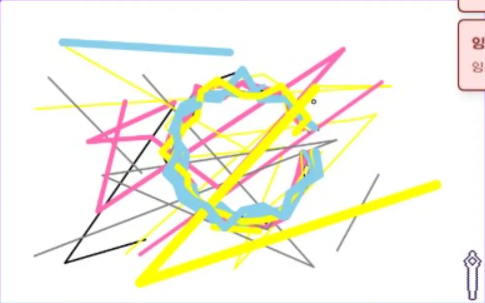
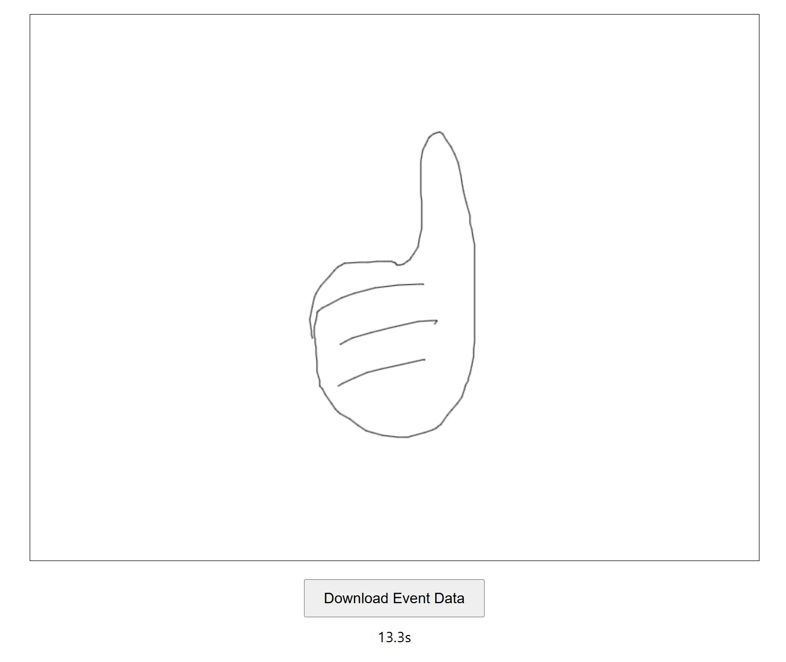

네이버 부스트캠프 Web30팀의 **방해꾼은 못 말려** 프로젝트를 클론하여 **리팩토링**하는 과정을 다룹니다.

- [기존 프로젝트 깃허브 링크](https://github.com/boostcampwm-2024/refactor-web30-stop-troublepainter)
- [리팩토링 프로젝트 깃허브 링크](https://github.com/boostcampwm-2024/refactor-web42-stop-troublepainter)

# 개요

**방해꾼은 못 말려**는 `Playwright`로 서로 다른 플레이어 간의 캔버스 일치율 테스트를 하고 있다. 이 포스트에서는 Playwright와 CDP로 성능 측정을 하는 과정을 다룬다.

# Playwright란

<https://playwright.dev/>

> Playwright enables reliable end-to-end testing for modern web apps.

Playwright란 웹 e2e 테스트 도구로 아래 기능을 제공한다.

- 크로스 브라우저, 크로스 플랫폼, 크로스 언어
- 엘레멘트가 실행가능할 때까지 자동 대기
- 필요한 조건이 충족될 때까지 반복 검사
- 스크린샷이나 비디오를 생성
- 여러 브라우저, 탭, 출처를 동시에 실행
- 브라우저에 원하는 이벤트를 생성
- Shadow DOM 확인 가능
- 격리된 브라우저 컨텍스트 생성 가능
- 인증 상태를 저장하여 재사용
- 유용한 도구 - codegen, Playwright inspector, Trace Viewer

# 일단 테스트가 돌아가게

개발이 진행되면서 기존에 동작하던 Playwright 테스트가 동작하지 않았다. 테스트 실행은 되지만 캔버스에 아무것도 그려지지 않는 것이 문제였다. 원인을 살펴보니 프로젝트 개발 중에 캔버스의 개수가 두 개가 되어 잘못된 캔버스를 셀렉트했던 것이다. 

```js
// 기존 코드
const canvas = await page.locator('canvas');

// 변경 코드(두 번째 캔버스를 선택)
const canvas = await page.locator('canvas + canvas');
```

# 시드 기반 랜덤으로 결과를 항상 동일하게

성능 측정을 정확하게 하기 위해선 매 테스트마다 동작을 동일하게 수행해야 한다. 하지만 기존 테스트는 Math.random()을 사용하고 있었기에 매번 드로잉 결과가 달라졌다. 따라서 시드 기반 랜덤으로 이를 해결하려 했다.

각 페이지에서 비동기적으로 그림을 그리고 있었기 때문에 페이지 별 드로잉 순서는 보장되지 않는다. 따라서 페이지 별로 시드를 유지해야 한다. 아래 seedRandom 함수로 항상 거의 동일한 결과를 보장할 수 있게 되었다.

```js
let initialSeed = 825347;
const seedMap = new Map(); // 페이지 별로 시드를 유지

function seedRandom(key: any) {
  if (!seedMap.has(key)) seedMap.set(key, initialSeed);
  let seed = seedMap.get(key);
  initialSeed *= 6807;
  seed = (seed * 16807) % 2147483647;
  seedMap.set(key, seed);
  return (seed - 1) / 2147483646;
}
```

이제 항상 아래의 그림을 그리게 되었다.



그러나 랜덤 드로잉 방식은 여전히 문제가 있었다. 바로 실제 드로잉과 다르다는 것이다. 실제로는 1초에 보통 60번 이상의 주기(마우스 무브 이벤트)로 드로잉을 하며, 한번 드로잉하는데 그려지는 직선의 길이도 다르다. 이러한 문제로 랜덤 드로잉이 실제 드로잉을 대변한다고 하기에는 한계가 있었다. 아래에서 실제 드로잉 데이터를 수집하여 이 문제를 해결하였다.

# 실제 드로잉 데이터를 수집

드로잉은 마우스 이벤트에 의해 발생한다. `mousedown`에서 드로잉이 시작되며, 각 `mousemove` 이벤트마다 직선이 생성되고, `mouseup`에서 이벤트가 끝난다. 

## 마우스 이벤트 수집 코드

이 이벤트를 수집하기 위해 캔버스에 그림을 그리면서 마우스 이벤트를 수집하는 html 코드를 작성하였다. 참고로 클릭이나 텍스트 입력같은 간단한 테스트는 [Playwright 자체 record 기능](https://playwright.dev/docs/codegen#recording-a-test)을 사용하여 생성할 수 있다.

<details>
  <summary><b>마우스 이벤트 수집 코드</b></summary>
  
```js
<!DOCTYPE html>
<html lang="en">
  <head>
    <meta charset="UTF-8" />
    <meta name="viewport" content="width=device-width, initial-scale=1.0" />
    <title>Canvas Event Collector</title>
    <style>
      canvas {
        border: 1px solid black;
        display: block;
        margin: 20px auto;
      }
      button {
        display: block;
        margin: 10px auto;
        padding: 10px 20px;
        font-size: 16px;
        cursor: pointer;
      }
      div {
        text-align: center;
      }
    </style>
  </head>
  <body>
    <canvas id="drawingCanvas" width="800" height="600"></canvas>
    <button id="downloadButton">Download Event Data</button>
    <div id="timer"></div>

    <script>
      const canvas = document.getElementById("drawingCanvas");
      const ctx = canvas.getContext("2d");
      const result = [];
      let drawing = false;
      let lastTimestamp = performance.now(); // 초기 타임스탬프
      const startTimestamp = Date.now();
      const timer = document.getElementById("timer");

      setInterval(() => {
        timer.innerText = `${((Date.now() - startTimestamp) / 1000).toFixed(
          1
        )}s`;
      }, 100);

      function recordEvent(type, x, y) {
        const now = performance.now();
        const delay = now - lastTimestamp;
        result.push([
          type,
          [Number((x / 800).toFixed(4)), Number((y / 600).toFixed(4))],
          Math.floor(delay),
        ]);
        lastTimestamp = now;
      }

      canvas.addEventListener("mousedown", (e) => {
        drawing = true;
        const rect = canvas.getBoundingClientRect();
        const x = e.clientX - rect.left;
        const y = e.clientY - rect.top;
        recordEvent("down", x, y);
      });

      canvas.addEventListener("mousemove", (e) => {
        if (!drawing) return;
        const rect = canvas.getBoundingClientRect();
        const x = e.clientX - rect.left;
        const y = e.clientY - rect.top;

        // 선 그리기
        ctx.lineTo(x, y);
        ctx.stroke();
        ctx.beginPath();
        ctx.moveTo(x, y);

        recordEvent("move", x, y);
      });

      canvas.addEventListener("mouseup", (e) => {
        if (!drawing) return;
        drawing = false;
        const rect = canvas.getBoundingClientRect();
        const x = e.clientX - rect.left;
        const y = e.clientY - rect.top;
        recordEvent("up", x, y);

        ctx.beginPath(); // 경로 초기화
      });

      canvas.addEventListener("mouseleave", () => {
        // 마우스가 캔버스를 벗어나면 그리기 중지
        if (drawing) {
          drawing = false;
          recordEvent("up", -1, -1); // 특수한 경우로 처리
        }
      });

      document
        .getElementById("downloadButton")
        .addEventListener("click", () => {
          const blob = new Blob([JSON.stringify(result, null, 2)], {
            type: "application/json",
          });
          const url = URL.createObjectURL(blob);
          const a = document.createElement("a");
          a.href = url;
          a.download = "event-data.json";
          a.click();
          URL.revokeObjectURL(url);
        });
    </script>
  </body>
</html>
``` 

{{ code | markdownify }}
</details>

아래 그림처럼 캔버스에 이미지를 그릴 수 있으며, 그리는 동시에 이벤트를 수집한다. 그림을 다 그리면 "Download Event Data" 버튼을 클릭하여 이벤트 파일을 다운로드할 수 있다.



이벤트는 아래와 같은 형식으로 기록된다. 각 이벤트는 배열에 순서대로 기록되며, 하나의 이벤트는 이름-위치-딜레이 순서로 구성된다. 

```json
[
  ["down", [0.2998, 0.3733], 1239],
  ["move", [0.2998, 0.3733], 41],
  ["move", [0.2986, 0.3767], 16],
  ["move", [0.2948, 0.39], 16],
  ["move", [0.2911, 0.4], 16],
  ["move", [0.2886, 0.4083], 16],
  ["move", [0.2848, 0.415], 16],
  ["move", [0.2811, 0.4267], 17],
  ["move", [0.2773, 0.4333], 16],
  ["move", [0.2736, 0.4417], 16]
]
```

## 마우스 이벤트를 읽고 이벤트 발생

Playwright에서는 위 형식의 이벤트를 읽고 브라우저에 이벤트를 생성해야 한다. 아래 drawEventData는 위 형식의 이벤트 데이터를 매개변수로 받아 브라우저에 이벤트를 생성한다. 메인 스레드 블로킹에 의해 딜레이가 더 지연되지 않도록 조정을 해두었다.

```js
export async function drawEventData(page: Page, eventData: any[]) {
  const CANVAS_SELECTOR = 'canvas + canvas';
  const canvas = page.locator(CANVAS_SELECTOR);
  const box = await canvas.boundingBox();
  if (!box) throw new Error('Canvas not found');

  const margin = {
    x: box.width * 0.05,
    y: box.height * 0.05,
  };

  const safeArea = {
    x: box.x + margin.x,
    y: box.y + margin.y,
    width: box.width - margin.x * 2,
    height: box.height - margin.y * 2,
  };

  let delayOfDelay = 0;

  for (const event of eventData) {
    const [eventName, pos, delay] = event;
    const convertedPos = [safeArea.x + pos[0] * safeArea.width, safeArea.y + pos[1] * safeArea.height];

    canvas.dispatchEvent('mouse' + eventName, {
      bubbles: true,
      cancelable: true,
      clientX: convertedPos[0],
      clientY: convertedPos[1],
    });

    const startDelay = performance.now();
    if (delay - delayOfDelay > 0) await new Promise((res) => setTimeout(res, delay - delayOfDelay));
    delayOfDelay = Math.floor(performance.now() - startDelay) - delay;
    if (delayOfDelay < 0) delayOfDelay = 0;
  }
}
```

이제 사용자가 실제로 드로잉하는 것처럼 테스트할 수 있다.

# CDP로 성능 측정

`CDP`란 Chrome DevTools Protocol의 약자이다. 말 그대로 크롬 개발자 도구를 사용하기 위한 프로토콜이다. 성능을 측정할 것이기 때문에 [performance 도메인](https://chromedevtools.github.io/devtools-protocol/tot/Performance)을 사용할 것이다. Playwright에서는 [CDPSession](https://playwright.dev/docs/api/class-cdpsession) 객체를 통해 CDP를 사용할 수 있다. 

```js
// 성능 측정 시작
const cdpSessions = await Promise.all(clients.map((e) => e.context.newCDPSession(e.page)));
await Promise.all(cdpSessions.map((e) => e.send('Performance.enable')));

/*
 드로잉 작업 수행
*/

// 성능 매트릭 수집
const performanceMetrics = await Promise.all(cdpSessions.map((e) => e.send('Performance.getMetrics')));
```

위에 처럼 성능 측정을 하면 여러 매트릭이 수집되며 그중 쓸모있는 것을 고르면 아래와 같다.

- **`LayoutCount`**: 페이지에서 발생한 **레이아웃 계산** 횟수
- **`RecalcStyleCount`**: **스타일 재계산** 횟수. CSS 변경이 많을수록 증가한다.
- **`LayoutDuration`**: 레이아웃 계산에 소요된 **누적 시간(초)**
- **`RecalcStyleDuration`**: 스타일 재계산에 소요된 **누적 시간(초)**
- **`ScriptDuration`**: JavaScript 실행에 소요된 **누적 시간(초)**
- **`V8CompileDuration`**: V8 엔진에서 **JavaScript 컴파일**에 소요된 **누적 시간(초)**
- **`TaskDuration`**: 모든 작업(Task) 처리에 걸린 **누적 시간(초)**
- **`TaskOtherDuration`**: 기타 작업 처리에 걸린 **누적 시간(초)**
- **`DevToolsCommandDuration`**: **DevTools 명령어** 처리에 걸린 시간
- **`ThreadTime`**: 메인 스레드가 작업한 **누적 시간(초)**
- **`ProcessTime`**: 전체 프로세스가 작업한 **누적 시간(초)**
- **`JSHeapUsedSize`**: 사용 중인 **JavaScript 힙 메모리 크기(Byte)**
- **`JSHeapTotalSize`**: 할당된 전체 **JavaScript 힙 메모리 크기(Byte)**

아래는 현재 성능 측정 결과이다. 그림꾼은 캔버스에 그림을 그리는 작업을 하므로 구경꾼에 비해 각 지표가 높게 나왔다.

| 지표 | 그림꾼(3명 평균) | 구경꾼(2명 평균) |
| :---: | :---: | :---: |
| **LayoutCount** | 443.33 | 22 |
| **RecalcStyleCount** | 497.33 | 7.5 |
| **LayoutDuration** | 0.04107 | 0.0082345 |
| **RecalcStyleDuration** | 0.09295 | 0.003816 |
| **ScriptDuration** | 1.65815 | 0.290524 |
| **V8CompileDuration** | 0 | 0 |
| **TaskDuration** | 7.96949 | 1.4498015 |
| **TaskOtherDuration** | 2.10131 | 1.1472135 |
| **DevToolsCommandDuration** | 4.07601 | 0.0000135 |
| **ThreadTime** | 5.26321 | 0.801016 |
| **ProcessTime** | 26.82355 | 18.878024 |
| **JSHeapUsedSize** | 15709316 | 11346870 |
| **JSHeapTotalSize** | 33177600 | 12861440 |