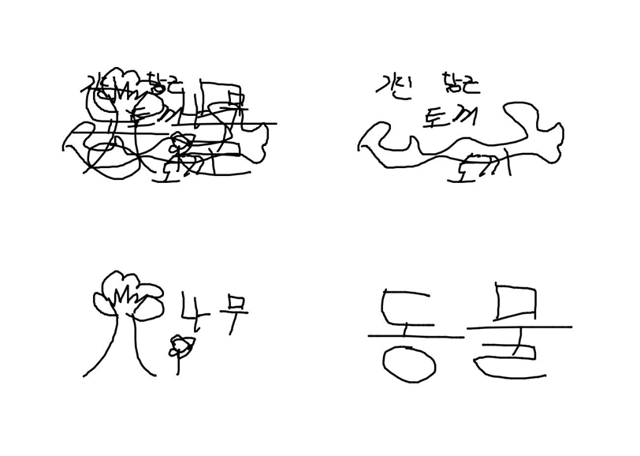
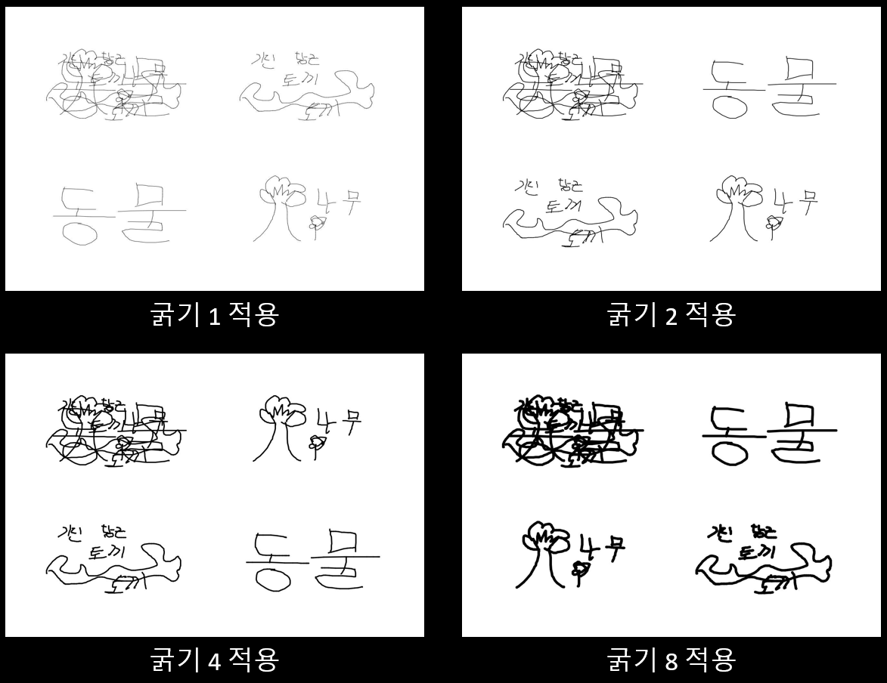
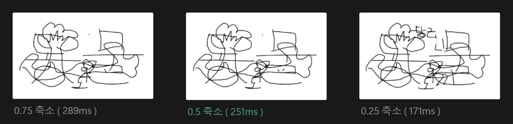

네이버 부스트캠프 Web30팀의 **방해꾼은 못 말려** 프로젝트를 클론하여 **리팩토링**하는 과정을 다룹니다.

- [기존 프로젝트 깃허브 링크](https://github.com/boostcampwm-2024/refactor-web30-stop-troublepainter)
- [리팩토링 프로젝트 깃허브 링크](https://github.com/boostcampwm-2024/refactor-web42-stop-troublepainter)

# 개요

이 게임은 그림꾼이 제시어를 그림으로 그리고, 방해꾼은 그림 그리는 것을 방해하고, 구경꾼은 제시어를 맞추는 게임이다. 여기서 하나의 문제가 있었는데, **그림꾼은 제시어를 그냥 글자로 쓸 수 있다는 것**이었다. 이렇게 된다면 구경꾼은 바로 정답을 맞출 수 있어 재미가 떨어질 것이며, 제시어를 못 맞추게 방해해야 하는 방해꾼이 불리할 것이다. 이 문제를 해결하기 위해 **캔버스 위에 글자를 삭제하고 제시어와 연관된 글자를 작성했다면 패널티**를 주도록 하자.

# 설계

이를 구현하기 위해선 AI의 도움이 필요하다. 네이버 부스트캠프에서 네이버 클라우드 플랫폼에서 사용할 수 있는 비용을 지원받았기 때문에 `클로바 OCR`과 `클로바 OCR`을 사용할 것이다. 둘은 각각 텍스트 인식, 제시어 유사도 검사에 사용된다. 이 기능의 전체적인 순서는 아래와 같다. 볼드체는 내가 담당한 부분이다.

1. **서버에서 플레이어 별로 이미지 생성**
1. 클로바 OCR로 텍스트 인식
1. **인식된 영역안에 모든 선 삭제**
1. 클로바 스튜디오 제시어와 유사도 검사
1. 패널티를 줄 플레이어 식별
1. 라운드가 종료되면 패널티

# 서버에서 캔버스로 이미지 생성

OCR을 하기 위해선 이미지가 있어야 한다. 우리는 이 이미지를 백엔드에서 만들기로 결정하였다. 굳이 클라이언트가 생성한 이미지를 쓰지 않고 서버에서 따로 만드는 이유는 아래와 같다.

- 클라이언트가 보내는 이미지는 **신용할 수 없다**.
- 글자를 쓴 플레이어를 식별하기 위해 **각자가 그린 그림을 분리**해야 한다.

## 캔버스 라이브러리 선택

백엔드에서 사용되는 Node.js는 웹과 달리 캔버스 API를 사용할 수 없으므로 라이브러리를 사용해야 한다. 캔버스 API와 유사한 후보군들을 정했다. 

- [pureimage](https://www.npmjs.com/package/pureimage): 자바스크립트로만 이루어져 있기 때문에 네이티브 의존성이 없지만 아래 두 개의 라이브러리보다 느리다는 단점이 있다.
- [node-canvas(canvas)](https://www.npmjs.com/package/canvas): 카이로 엔진 기반으로 네이티브 의존성이 존재한다. 
- [skia-canvas](https://www.npmjs.com/package/skia-canvas): 스키아 엔진 기반으로 네이티브 의존성이 존재한다.

pureimage는 네이티브 의존성이 없어 문제가 생길 일이 적으므로 첫째주에는 pureimage로 개발을 하였다. 이후에 skia-canvas와 node-canvas를 각각 사용해봤는데, 드로잉 속도는 거의 비슷하고 캔버스에서 jpeg로 데이터를 변환하는 과정이 skia-canvas가 이상하게 느려 node-canvas를 선택하였다. 

## 이미지를 생성

한 라운드의 드로잉 시간이 끝나면 한 번에 그림을 그리고 JPEG 이미지로 추출한다. 그림은 총 4개를 생성해야 한다. 다 같이 그린 그림, 그림꾼1의 그림, 그림꾼2의 그림, 방해꾼의 그림. 그 이유는 글자를 어떤 플레이어가 썼는지 식별하기 위해서이다. 다 같이 그린 그림도 따로 생성하는 이유는 두명 이상의 플레이어가 합작하여 글자를 쓸 수도 있기 때문이다. 

## 이미지 스프라이트로 비용 절감

위에서 총 4개의 이미지를 생성한다고 했다. 이렇게 되면 한 라운드에 **OCR 비용이 12원(3원 * 4회)이 소모**된다. 한 게임은 보통 5개의 라운드로 이루어져 있으므로 한 게임 당 60원이 소모된다. 만약에 이 게임이 유명해져서 하루에 1000 게임이 진행된다면 하루에 60000원이 소모되고, 한달에는 약 180만원이 소모된다. 이는 그렇게 작은 금액이 아니다.

따라서 아래의 그림처럼 4개의 이미지를 합쳐 하나의 **이미지 스프라이트**로 만들었다. 이제 비용은 1/4로 줄었다. 덤으로 이미지의 크기가 커져 큰 글씨를 더 잘 인식할 수 있게 되었다. 이에 따라 로직은 살짝 복잡해졌는데 글자가 인식된 위치로 어떤 플레이어가 쓴 글자인지 식별해야 한다. 



## 선 굵기 조절로 OCR 인식률 향상

이 게임은 선의 굵기를 선택하여 그림을 그릴 수 있다. 문제는 선이 두꺼운 경우 글자가 잘 인식이 안되는 것이었다. 따라서 가장 글자 인식이 잘되는 선 굵기를 찾으려고 한다. 아래는 굵기를 1, 2, 4, 8로 이미지를 생성해 보았고



결과는 굵기 1에서 인식률이 가장 좋았다.

| 굵기 | 기린 | 당근 | 토끼 | 동물 | 나무 |
|:---:|:---:|:---:|:---:|:---:|:---:|
| **1** | 기린 | 당근 | 토끼 | 동 물 | 나무 |
| **2** | 기린 | 당근 | 토끼 | 동원 | 나무 |
| **4** | 기인 | 당근 | 토끼 | 동물 | 나무 |
| **8** | 기신 | 참조 | 토끼 | 동물 | 남구 |

## 성능 최적화를 위해 이미지 크기 조절

캔버스를 JPEG로 변환하는 시간이 너무 오래 걸렸다. 이미지를 그리는데 드는 시간보다 약 20배가 오래 걸렸다. 이를 해결하기 위해 캔버스 크기를 줄여 최적화를 하려고 한다. 단, 크기가 줄었을 때 인식률이 너무 떨어지면 안된다. 

pureimage를 기준으로 측정을 하였다. 캔버스를 축소하지 않았을 때는 326ms가 측정되었다. 0.75배, 0.5배, 0.25배 축소를 해보았으며 0.5배가 인식률이 떨어지지 않으면서 가장 축소율이 높았다.



# 캔버스에서 글자를 삭제하기

OCR API로 요청하는 부분은 다른 팀원분이 해주셨다. 이제 API 요청의 결과로 나온 텍스트 인식 영역에 존재하는 글자를 삭제해야 한다. 글자는 여러개의 직선으로 이루어져 있다. 이 직선들을 삭제하는 CRDT 메시지를 만들어 클라이언트에게 보내야 한다. 

텍스트가 인식된 영역은 4개의 점으로 이루어진 사각형이다. 직선의 두 점이 모두 사각형 영역 안에 존재하는지 확인하면 된다. 나는 CCW(Counter Clock Wise) 알고리즘으로 볼록 다각형 내부에 점이 존재하는지 확인하는 방법을 사용했다. CCW는 벡터의 외적을 이용하는 방법으로 세 점이 시계 방향인지 시계 반대 방향인지 알 수 있다. 검사할 점과 다각형의 인접한 두점으로 CCW를 계산해 모두 시계 방향이거나 시계 반대 방향이면 점이 다각형 내부에 있는 것이다. 단 다각형은 내각의 크기가 180도 이하인 볼록 다각형이며, 다각형의 모든 점은 시계 또는 시계 반대 방향으로 정렬되어 있어야 한다. 

```js
const isPointInBoundary = (point: { x: number; y: number }, boundary: { x: number; y: number }[]) => {
    const C = this.applyScale(point);
    const crossList = boundary.map((A, index) => {
        const B = boundary[(index + 1) % boundary.length];
        return (B.x - A.x) * (C.y - A.y) - (B.y - A.y) * (C.x - A.x);
    });
    return crossList.every((cross) => cross >= 0) || crossList.every((cross) => cross <= 0);
};
```

삭제할 선들을 정했다면, 이제 클라이언트에게 선을 삭제하라고 메시지를 보내야 한다. CRDT를 사용하고 있으므로 이를 이용해야 한다. 여기서 CRDT 메시지의 종류는 두 가지가 있다. **update**와 **sync**이다. update는 하나의 변경 사항을 적용하는 것이다. sync는 다수의 변경 사항을 적용하는 것이다. 다수의 직선을 삭제해야 하므로 sync를 사용한다. 

```js
const resultMapState = lwwMap
    .getActiveStrokes()
    .filter(({ stroke, id }) =>
        newBoundaryList.some(({ boundary, playerId }) => {
            if (playerId !== lwwMapState[id].peerId && playerId !== this.SHARED_PLAYER_ID) return false;
            // 선의 점이 모두 경계 안에 있는지 확인
            return stroke.points.every((strokePoint) => isPointInBoundary(strokePoint, boundary));
        }),
    )
    .reduce((acc: MapState, { id, stroke }) => {
        acc[id] = { peerId: lwwMapState[id].peerId, timestamp: stroke.timestamp, value: stroke, isDeactivated: true };
        return acc;
    }, {});

return { type: CRDTMessageTypes.SYNC, state: resultMapState };
```

# Playwright로 E2E 테스트

이 기능을 구현하면서 Playwright를 정말 잘 사용하였다. [이런 방법(Playwright와 CDP로 드로잉 성능 측정)](re-troublepainter-playwright.html#hyper4)으로 매번 동일한 동작 환경을 만들었다. 덕분에 빠르게 테스트를 할 수 있어서 개발 시간을 줄일 수 있었다. 