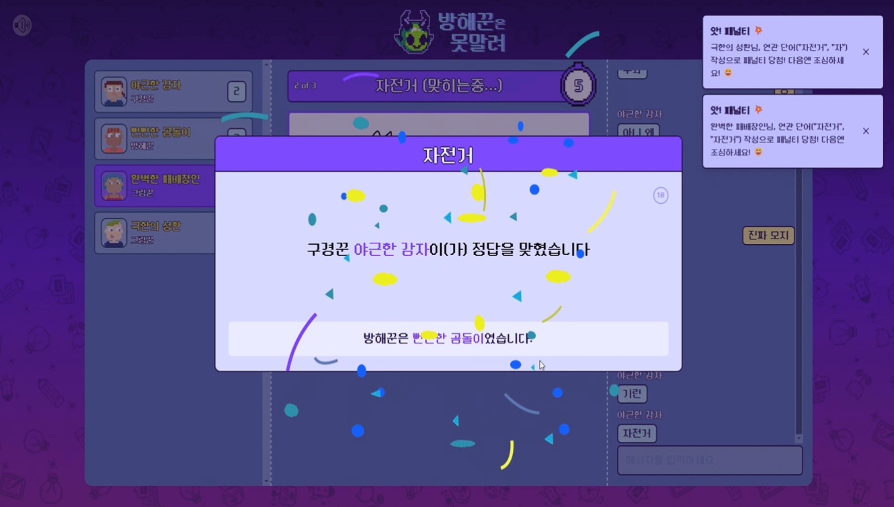

# 프로젝트



## 실시간 퀴즈 플랫폼 QuizGround

[배포 링크](https://quizground.site/) / [깃허브](https://github.com/boostcampwm-2024/web10-QuizGround)

- 개발인원: 5명
- 개발기간: 2024.11 ~ 2024.12
- 역할: 프론트엔드

네이버 부스트캠프에서 개발한 실시간 퀴즈 플랫폼입니다. 직접 만든 퀴즈를 다른 사용자와 같이 풀 수 있습니다. 클릭이나 터치로 이동하여 정답을 선택할 수 있습니다. 네이버 부스트캠프의 모든 인원이 동시에 플레이할 수 있도록 200명 동시 플레이를 목표로 했습니다. 

<ul></ul>




## 웹 게임 Level10

[배포 링크]({{page.blog_url}}/Level10/) / [깃허브](https://github.com/ijun17/Level10)

- 개발인원: 1명(본인)
- 개발기간: 2021.01 ~

코딩으로 스킬을 만들어 몬스터를 물리치는 2D RPG 게임입니다. 자바스크립트에 대한 실력을 향상하고 싶어 진행했던 사이드 프로젝트입니다. 바닐라 자바스크립트로 물리엔진, 멀티 플레이, 화면 UI 및 렌더링, 스케줄링 등을 구현했습니다. 또한 Node.js로 멀티플레이의 매칭 서버(시그널링 서버)를 구현했습니다.

<ul></ul>




## (리팩토링) 방해꾼은 못 말려

- 개발인원: 4명
- 개발기간: 2025.01 ~ 2025.2

[배포 링크](https://re-troublepainter.kro.kr/) / [깃허브](https://github.com/boostcampwm-2024/refactor-web42-stop-troublepainter)

네이버 부스트캠프에서 다른 팀의 프로젝트에 **CS 리팩토링**과 **인공지능 리팩토링**을 했습니다. 이 프로젝트는 "그림꾼"이 주어진 제시어를 그림으로 그리고, "방해꾼"은 이를 방해하며, "구경꾼"이 제시어를 맞추는 게임입니다. 캔버스에서 동시에 여러 플레이어가 그림을 그리기 위해 CRDT가 사용되었습니다.

<ul></ul>




## 기타 프로젝트

### 모바일 기기 원격 접근 시스템

[배포(웹)]({{page.oracle_url}}/connect) / [깃허브](https://github.com/ijun17/mobile-connect)

한 기기에서 다른 기기로 파일을 보내는 과정에서 클라우드 같은 외부 서비스를 거치는 것에 불편함을 느껴 모바일앱프로그래밍 수업에서 실험적으로 개발한 프로젝트입니다. 안드로이드 웹 뷰로 하이브리드 앱을 개발하였고, 웹에서 파일 접근을 위해 브리지를 만들었으며, P2P 통신을 위해 WebRTC를 사용하였습니다.

<ul></ul>

 

### 코인 급상승 예측 시스템

[배포]({{page.oracle_url}}/coins) / [깃허브](https://github.com/ijun17/surge-coin-predictor)

스팸 코인의 가격 급상승을 `Random Forest` 및 `ExtraTreesClassifier`로 예측하였습니다. 시계열 데이터를 학습하기 위해 슬라이딩 윈도우 방식으로 N일간의 데이터를 합친 후 M일 뒤 R배 상승 여부로 이진 분류했습니다.

<ul></ul>

 

### WebRTC 채팅 서비스

[깃허브](https://github.com/ijun17/WebRTC-chat)

WebRTC를 공부하기 위해 개발한 간단한 채팅 서비스입니다. 이 프로젝트에서 구현한 내용을 기반으로 Level10(웹게임)의 멀티플레이를 구현하였습니다.

<ul></ul>


{{project1 | markdownify}}

{{project2 | markdownify}}

{{project3 | markdownify}}

{{project4 | markdownify}}

# 수상내역

[증빙자료](https://cyber-mitten-d95.notion.site/11d1f8769793474e8c4ce2c8f3c0d1c6?pvs=4)

### 2023 XR 디바이스 콘텐츠 아이디어톤 장려상

(구미전자정보기술원장상, 2023.11)

### 2024 자율주행 SW 교육 및 경진대회 대상

(전북대학교 공과대학장상, 2024.02)

### 2024 한국정보기술학회 대학생논문경진대회 금상

(”자이로센서 데이터 및 이미지 데이터를 이용한 Aruco 마커 기반 AR 안전 교육 시스템”, 2024.05)

# 활동

### 전북대학교 소프트웨어공학과 동아리 AM:PM

- 기간: 2020.03 ~ 현재
- 활동: 2020년도 웹 스터디 멘티, 2023년도 운영진, 2023년도 깃허브 스터디 멘토

### 코드클럽 한국위원회 코딩교육 봉사활동

- 기간: 2023.04 ~ 2023.07
- 활동: 중산초등학교 학생들에게 코딩 교육을 했습니다.

### 전북대학교 AI동아리 Jbig

- 기간: 2024.03 ~ 현재
- 활동: 매주 파이썬 인공지능 세미나에 참석했고, 비전공자 분들과 프로젝트를 진행했습니다.

### 네이버 부스트캠프 풀스택 과정

- 기간: 2024.06 ~ 2025.02
- 활동: 부스트캠프 베이직•챌린지•멤버쉽 수료, "QuizGround" 프로젝트 진행, "방해꾼은 못 말려" 프로젝트 리팩토링

# 포스트

<ul>
  
    <li>
      [{{ post.date | date: "%Y-%m-%d" }}]  
      <a  class="post-link" href="{{ post.url }}">{{ post.title }} </a>
    </li>

</ul>
